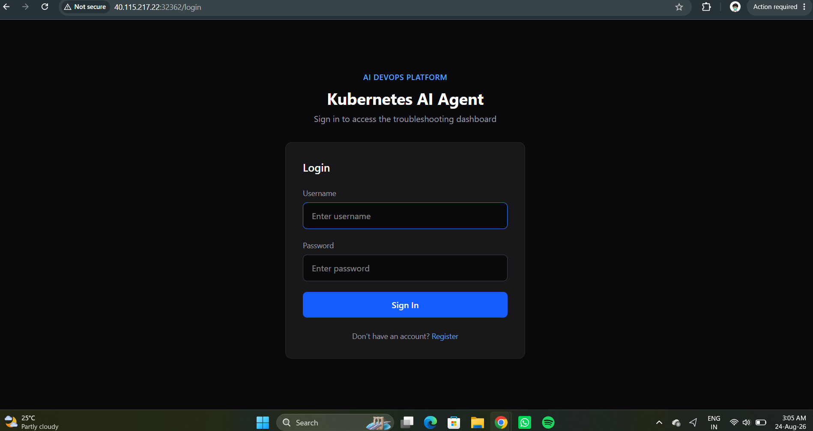

# 🤖 AI Kubernetes Troubleshooting & Monitoring Agent

An AI-powered DevOps platform for monitoring, investigating, and troubleshooting Kubernetes applications.

This project combines **Artificial Intelligence, Kubernetes, FastAPI, Next.js, PostgreSQL, Docker, Prometheus, Grafana, and Jenkins** to provide a complete Kubernetes monitoring and troubleshooting solution.

The platform can inspect Kubernetes resources, collect application and cluster information, identify unhealthy workloads, analyze logs and Kubernetes events, and use AI to generate troubleshooting explanations and recommended actions.

---

## 🚀 Project Overview

Modern Kubernetes environments can contain many Pods, Deployments, Services, Nodes, containers, and application components.

When something fails, engineers normally need to manually check:

- Pod status
- Container logs
- Kubernetes events
- Deployment status
- Node information
- Networking
- CPU and memory usage
- Application health
- Previous failures

This project automates a large part of this investigation process.

The system provides a centralized web interface where Kubernetes information can be investigated and analyzed.

### Main Workflow

```text
                    ┌─────────────────────┐
                    │      User           │
                    │  Web Dashboard      │
                    └──────────┬──────────┘
                               │
                               ▼
                    ┌─────────────────────┐
                    │   Next.js Frontend  │
                    └──────────┬──────────┘
                               │
                               ▼
                    ┌─────────────────────┐
                    │   FastAPI Backend   │
                    └──────────┬──────────┘
                               │
             ┌─────────────────┼──────────────────┐
             │                 │                  │
             ▼                 ▼                  ▼
      ┌────────────┐    ┌─────────────┐    ┌─────────────┐
      │ Kubernetes │    │ PostgreSQL  │    │ AI Service  │
      │ Cluster    │    │ Database    │    │ Diagnosis   │
      └─────┬──────┘    └─────────────┘    └──────┬──────┘
            │                                      │
            │                                      ▼
            │                              ┌──────────────┐
            │                              │ AI Analysis  │
            │                              └──────────────┘
            │
            ▼
   ┌─────────────────────┐
   │ Prometheus Metrics  │
   └──────────┬──────────┘
              │
              ▼
      ┌─────────────────┐
      │ Grafana         │
      │ Monitoring      │
      │ Dashboard       │
      └─────────────────┘

🏗️ Architecture

The application is deployed as multiple Kubernetes workloads.

Application Namespace
ai-devops
│
├── Frontend
│   ├── Deployment
│   └── NodePort Service
│
├── Backend
│   ├── Deployment
│   └── NodePort Service
│
└── PostgreSQL
    ├── Deployment
    ├── ClusterIP Service
    └── PersistentVolumeClaim

Monitoring Namespace
monitoring
│
├── Prometheus
├── Grafana
├── Alertmanager
├── kube-state-metrics
├── Node Exporter
└── Prometheus Operator

🖼️ Project Screenshots

Login -


